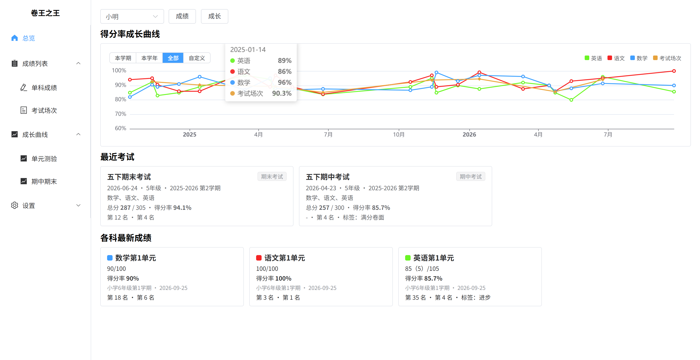
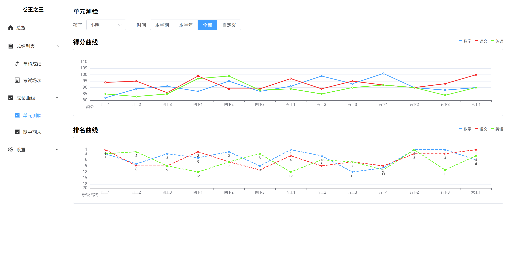
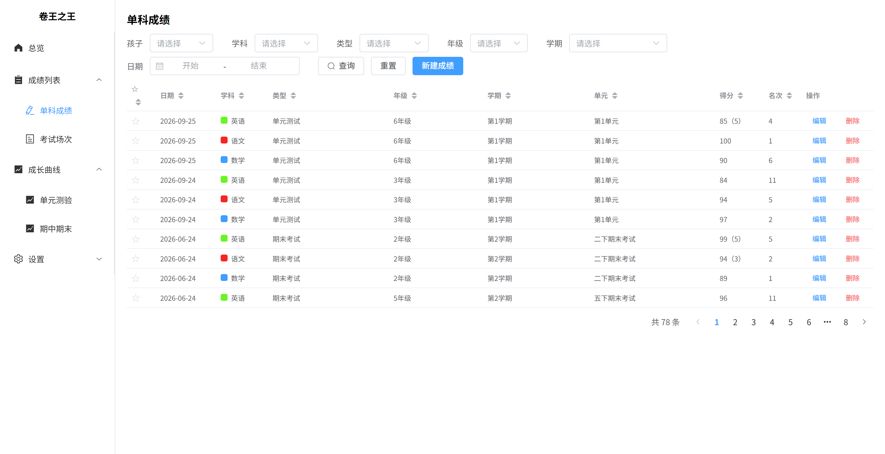
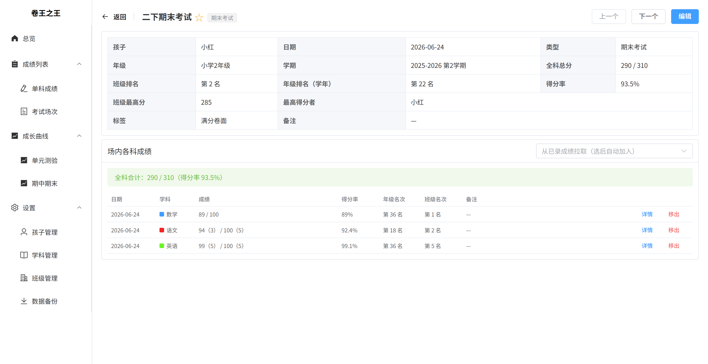
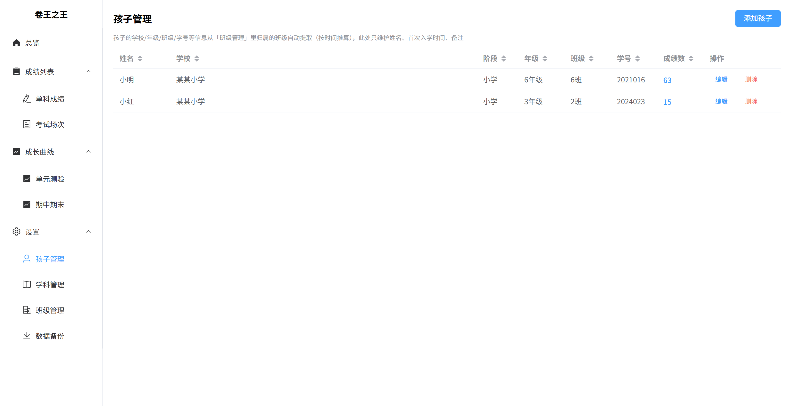
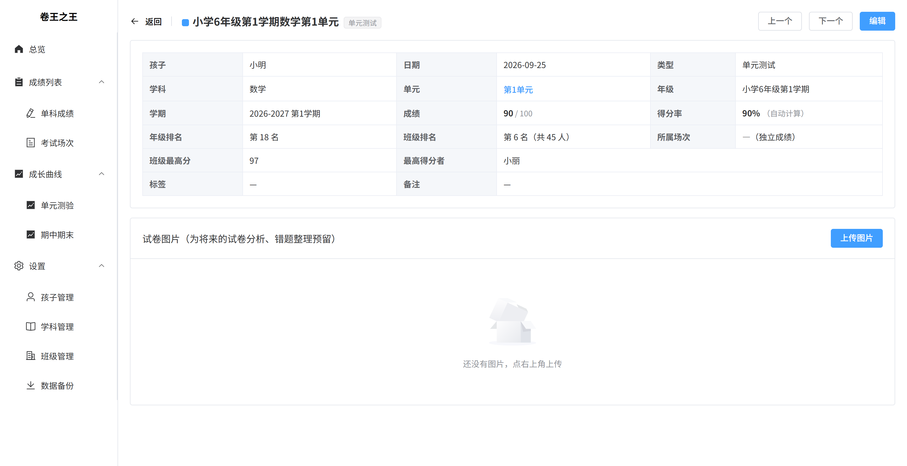

# 卷王之王（overachievers）

[](https://github.com/xuhaosl/overachievers/actions/workflows/docker.yml)
[](https://github.com/xuhaosl/overachievers/pkgs/container/overachievers)
[](LICENSE)

家庭自用的孩子成绩管理工具：记录、管理、可视化孩子从小学到高中的成绩。单文件 SQLite 存储，部署在自己 NAS / 服务器 / 电脑上，手机电脑浏览器都能用。

## 界面预览

| 总览 | 成长曲线（单元测验） |
|---|---|
|  |  |

| 成绩列表 | 考试场次详情 |
|---|---|
|  |  |

| 孩子管理 | 单科成绩详情 |
|---|---|
|  |  |

## 功能

- **孩子管理**：登记孩子（姓名、首次入学时间、备注），阶段/年级/学校/班级按就读经历自动提取，点进详情页可查看绑定的所有班级
- **班级管理**：每个孩子可有多段就读经历（小学班、初中班…），含学校、阶段、入学时间、人数、学号、主要竞争对手；年级按"入学时间 + 记录日期"自动推算，毕业后保留历史
- **学科管理**：自定义学科、颜色、归属孩子；学期以 TAB 方式管理（可从"一上~高三下"候选添加），单元按学期编号管理
- **录成绩**：
  - 「单科成绩」：单元测试等单科成绩，单元多选、附加分、班级/年级名次（支持「前N」这类写法）、标签、标星
  - 「考试场次」：期中/期末等全科考试，先建场次再逐科录分或从已录成绩拉取（按考试类型匹配）；全科总分、班级排名、年级排名（学年）
  - 年级、学期按日期自动推断；期末考试的年级排名在同年级同学年内自动联动
- **成绩列表**：单科成绩 / 考试场次双视图，多条件筛选，任意列点击排序
- **详情页**：单科成绩、考试场次均有详情页（含班级最高分、最高得分者、标签备注等），支持"上一个/下一个"快速翻阅
- **成长曲线**：
  - 单元测验：各科得分曲线 + 排名曲线（横坐标如"N上N"＝N年级上学期第N单元）
  - 期中期末：得分曲线（单科 + 总分）+ 排名曲线（班级排名 + 年级排名，横坐标如"N下末"＝N年级下学期期末）
  - 图例点选控制显示/隐藏，纵坐标随数据自动适配
- **总览**：得分率成长曲线（按学科颜色 + 场次总分）、最近考试、各科最新成绩
- **数据备份**：一键导出全部数据为 JSON 备份文件；导入备份文件即可整库恢复
- **访问密码（可选）**：设置 `APP_PASSWORD` 后需登录，适合暴露公网时开启

## 数据说明

- 所有数据存在 **一个 SQLite 文件** 里（`data/overachievers.db`），成绩图片在 `data/uploads/`
- 备份 = 复制 `data` 目录，或直接用系统内「设置 → 数据备份」导出 JSON
- 数据完全保存在你自己的机器上，不经过任何第三方

## Docker 部署

### 方式一：直接使用镜像（无需源码，推荐）

镜像已发布到 ghcr.io，支持 amd64 / arm64 双架构：

```bash
docker run -d \
  --name overachievers \
  -p 8100:8100 \
  -v ./data:/app/data \
  -e TZ=Asia/Shanghai \
  --restart unless-stopped \
  ghcr.io/xuhaosl/overachievers:latest
```

或写成 docker-compose.yml：

```yaml
services:
  overachievers:
    image: ghcr.io/xuhaosl/overachievers:latest
    container_name: overachievers
    ports:
      - "8100:8100"
    volumes:
      - ./data:/app/data
    environment:
      - TZ=Asia/Shanghai
      # - APP_PASSWORD=你的密码    # 仅暴露公网时需要，见下文
    restart: unless-stopped
```

浏览器打开 `http://<NAS的IP>:8100` 即可使用。

### 方式二：从源码构建

```bash
git clone https://github.com/xuhaosl/overachievers.git
cd overachievers
docker compose up -d --build
```

### 方式三：NAS 图形界面

提供 Docker 图形界面的 NAS 一般支持两种方式：

1. **Compose 项目**：Docker → Compose → 新建，粘贴方式一的 YAML，启动
2. **本地镜像导入**：
   - 在电脑上执行 `docker build -t overachievers:latest .`，再 `docker save -o overachievers.tar overachievers:latest`
   - 把 `overachievers.tar` 拷进 NAS，Docker → 镜像 → 本地导入
   - 用该镜像创建容器：
     - 端口映射：`8100 -> 8100`
     - 文件夹映射：在 NAS 上建一个空文件夹映射到容器 `/app/data`
     - 环境变量（可选）：`APP_PASSWORD=你的密码`、`TZ=Asia/Shanghai`

### 访问密码（可选）

默认局域网内无需登录。若要把服务暴露到公网，设置环境变量 `APP_PASSWORD`（或 `docker-compose.yml` 旁放 `.env` 文件），打开页面时会先要求输入密码。

### 应用内一键升级（v1.0.1+）

运行中的容器即可自助升级，无需删镜像重建：**数据备份 → 版本与升级 → 检查更新 → 一键升级**。升级由 Watchtower（HTTP API 手动触发模式）完成：拉取 ghcr.io 最新镜像并重建容器，`/app/data` 数据目录不受影响。版本号由仓库根目录 `VERSION` 文件定义，CI 构建时注入镜像。

要启用一键升级，把 compose 改为如下结构（watchtower 通过内网调用，不对外暴露端口；token 请改成一个自己的随机字符串）：

```yaml
services:
  overachievers:
    image: ghcr.io/xuhaosl/overachievers:latest
    container_name: overachievers
    ports:
      - "8100:8100"
    volumes:
      - ./data:/app/data
    environment:
      - TZ=Asia/Shanghai
      - WATCHTOWER_TOKEN=请改成随机字符串
    labels:
      - com.centurylinklabs.watchtower.enable=true
    restart: unless-stopped

  watchtower:
    image: containrrr/watchtower
    container_name: watchtower
    volumes:
      - /var/run/docker.sock:/var/run/docker.sock
    environment:
      - TZ=Asia/Shanghai
      - WATCHTOWER_LABEL_ENABLE=true          # 只监控带上面 label 的容器
      - WATCHTOWER_HTTP_API_UPDATE=true       # 开启 HTTP API 手动触发（1.7.1 实测）
      - WATCHTOWER_HTTP_API_TOKEN=请改成随机字符串   # 与应用侧 WATCHTOWER_TOKEN 一致
      - WATCHTOWER_CLEANUP=true               # 升级后自动删旧镜像
    restart: unless-stopped
```

## 本地运行

```bash
# 后端（端口 8100，首次启动自动建库）
cd backend
pip install -r requirements.txt
uvicorn app.main:app --host 127.0.0.1 --port 8100

# 前端（可选，仓库已带构建产物；改代码时才需要）
cd frontend
npm install
npm run build   # 产物复制到 backend/static 后由后端统一提供服务
```

浏览器打开 `http://127.0.0.1:8100` 即可使用。

## 技术栈

后端 Python FastAPI + SQLAlchemy + SQLite；前端 Vue3 + Element Plus + ECharts；支持 Docker 单容器部署，也可直接 uvicorn 运行。

## License

[MIT](LICENSE)
